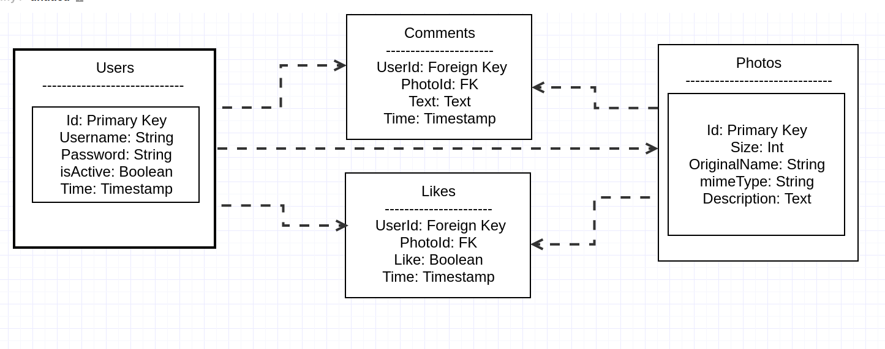

# Happygram

A photo sharing app that in no way infringes on any other photos sharing apps because it is clearly original and also superior.

Checkout the app on Heroku;
https://whispering-ocean-44665.herokuapp.com

A test profile is provided to take a look around;
username: testuser
password: testpassword


### Project organization / file tree
```

├── app.js 			# Entry point of the app
├── assets			# Static assets folder
│   ├── images
│   ├── scripts
│   │   ├── index.js
│   │   └── js-cookie.js
│   └── styles
│       ├── main.css
│       └── reset.css
├── models			# Database schema is organized here
│   ├── comment.js
│   ├── like.js
│   ├── photo.js
│   └── user.js
├── package.json
├── package-lock.json
├── plan.md
├── README.md
├── routes			# Routing is organized by function, somehow
│   ├── handlers		# handlers may or may not be employed as a way
│   │   ├── photoHandler.js 	# to organize all functionality in a dedicated
│   │   └── userHandler.js 	# file
│   ├── posts.js 		# 
│   └── routes.j
├── util			# Utility directory for middlewares
│   ├── gram.js 		# This is a handler for photo model, will be moved if handlers are implemented
│   ├── sessionMW.js 		# Will create and authenticate sessions and modify app behavior accordingly
│   ├── sql.js 			# Creates the sequelize database schema
│   └── userAuthMW.js 		# 
└── views			# 
    ├── form.pug
    ├── gram.pug
    ├── home.pug
    ├── layout.pug
    └── template.pug

```

### DB schema



### Routing


